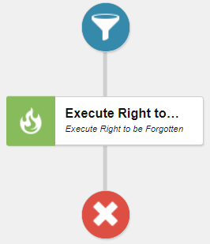

 

# "Execute Right To Be Forgotten" Marketing Automation Action

 

## Prerequisites

- Sitecore XP v9.1 Initial Release

## Installing the plugin

TODO

## Developing / Contributing
See [contributing.md](./contributing.md)